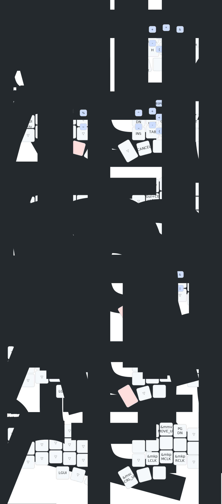

# Corne OLED Wireless — ZMK & Keyd Config

Personal unified keyboard configuration for a **42-key Corne** (nice_nano_v2) wireless split keyboard and a built-in laptop keyboard.

Architecture based on [urob/zmk-config](https://github.com/urob/zmk-config).

## 🗺️ Layout



## ✨ Features

- **Colemak-DH** base layout
- **"Timeless" Homerow Mods** — balanced flavor with positional hold-tap and `require-prior-idle-ms`
- **Vertical & Horizontal Combos** for symbols (no dedicated symbol layer needed)
- **Smart-num** — tap: num-word, double-tap: sticky num, hold: num layer
- **Smart-shift** — tap: sticky-shift, double-tap: caps-word, hold: shift
- **Smart-mouse** — auto-toggle mouse layer (requires zmk-tri-state)
- **Nav cluster** — arrows double as home/end/doc-start/doc-end on long-press
- **Laptop Parity** — `keyd` configuration mirroring the 34-key layout to the built-in laptop keyboard

## 📂 File Structure

```text
├── config/
│   ├── base.keymap    # Shared 5-column keymap (layers, behaviors, macros)
│   ├── corne.keymap   # 42-key Corne wrapper (outer columns + key-labels)
│   ├── corne.conf     # Board-specific Kconfig (OLED, Studio, BLE, sleep)
│   ├── combos.dtsi    # Symbol combos (vertical + horizontal)
│   ├── mouse.dtsi     # Mouse emulation settings
│   └── west.yml       # West manifest (ZMK + modules)
├── keyd/
│   └── laptop-urob.conf # Laptop keyboard mapping matching the Corne
├── keymap-drawer/     # Automatically generated SVG & YAML diagrams
└── .github/workflows/ # GitHub Actions (Firmware builds & Diagram drawing)
```

## 💻 Laptop Built-in Keyboard (`keyd`)

To maintain a consistent typing experience when away from the Corne, this repository includes a `keyd` configuration that maps the laptop's built-in keyboard to act exactly like the Corne (including Colemak-DH, Homerow Mods, Combos, and the 4-thumb layer cluster).

**To activate:**
```bash
sudo cp keyd/laptop-urob.conf /etc/keyd/default.conf
sudo keyd reload
```
*(Use `Meta + Alt + Shift + T` to toggle the layout on/off)*

## 🛠️ Building & Automation

- **Firmware:** Firmware builds automatically via GitHub Actions on push. Download the `.uf2` files from the Actions tab.
- **Visuals:** The `keymap-drawer` workflow automatically parses `config/corne.keymap` and redraws the `corne.svg` diagram on every push.

To build ZMK locally:
```bash
west init -l config
west update
west zephyr-export
west build -s zmk/app -b nice_nano_v2 -- -DSHIELD=corne_left -DZMK_CONFIG="$(pwd)/config"
```
